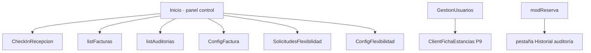

# WPF — Novedades (Proyecto Individual)

Extensión del escritorio intermodular (MVVM + API REST). Login, gestión de usuarios, habitaciones y reservas base están en la memoria del módulo; **este README solo cubre pantallas y servicios añadidos después**.

API: [README API](../API-Intermodular-Ysael/README.md)

---

## Resumen vs memoria intermodular

| Antes (memoria) | Añadido en WPF individual |
|-----------------|---------------------------|
| Inicio, usuarios, habitaciones, reservas (alta/lista/modificar) | Panel control ampliado, check-in recepción, auditoría global, facturas, P19, P9 ficha estancias, config fiscal/flex/operacional |
| `Room` básico | Galería, ofertas, catálogo extras en `modRoom` |
| Sin PDF ni checkout | Justificante + factura PDF, checkout, reenvío email |
| Sin trazabilidad | Auditoría con columnas Antes/Después + toggle registro |

---

## Navegación nueva (tras login)

---

## Módulos y archivos nuevos

### Modelos

| Archivo | Uso |
|---------|-----|
| `BookingAuditEntry`, `AuditChangeDetail`, `AuditCambioFila`, `HistorialAuditoriaFila` | Auditoría API |
| `HotelInvoiceItem` | Listado facturas |
| `InvoiceSettingsDto`, `FlexibilitySettingsDto`, `FlexibilityStatusDto`, `PendingFlexibilityItemDto` | Config y P19 |
| `ReceptionCheckInStatusDto` | Ventana check-in |
| `ExtraServiceDto` | Catálogo extras |
| `Room` (campos nuevos) | `Images`, `ExtraServices`, oferta, `IsOperational`, `IsOccupiedNow` |

### Servicios

| Servicio | API |
|----------|-----|
| `ReservationService` | checkout, check-in, PDF justificante/factura, histórico facturas, email factura, auditoría |
| `FlexibilityService` | cola P19, review, settings |
| `UserStayService` | P9 history/stats |
| `InvoiceSettingsService` | `/settings/invoice` |
| `OperationalSettingsService` | `/settings/operational` (auditoría on/off) |
| `ExtraServiceCatalogService` | `/room/extra-services` |

### Pantallas / ViewModels

| Pantalla | Función |
|----------|---------|
| `listFacturas` | Histórico `HotelInvoice`, filtros, PDF, reenvío email |
| `ConfigFactura` | Datos fiscales emisor → API |
| `listAuditorias` | Auditoría global; checkbox registrar auditorías; columnas Antes/Después |
| `AuditoriaReserva` / pestaña en `modReserva` | Historial por reserva con `detalle_cambios` |
| `CheckInRecepcion` | Registro llegada física (clic desde tarjetas Inicio) |
| `SolicitudesFlexibilidad` | Cola P19 del día (Activas/Inactivas) |
| `ConfigFlexibilidad` | €/h, rangos gratuitos, auto-aprobación |
| `ClientFichaEstancias` | P9: historial + stats + export CSV |
| `modRoom` (ampliado) | Galería URLs, oferta %, servicios extra |
| `modReserva` (ampliado) | Justificante PDF, checkout, bloque P19, factura |

### Helpers

- `AuditDisplayHelper`, `AuditUiMapper` — JSON API → filas UI legibles
- `Themes/AppTheme.xaml`, `BoolToVisibilityConverter`, `ImageUrlConverter`, `UiShell`

---

## Check-in en recepción

- **Inicio:** tarjetas reservas activas con `guest_name`, `guest_dni`, badge check-in
- **Flujo:** `GET check-in-status` → confirmar → `POST /reservation/check-in`
- No confundir con P19 ni con campo `check_in` de la reserva

---

## P19 · Flexibilidad (recepción)

- Banner + **Ver cola** en Inicio → `SolicitudesFlexibilidad`
- **modReserva:** aprobar/rechazar entrada anticipada y salida tardía (`pending`)
- **ConfigFlexibilidad:** reglas €/h (barra superior)
- Plata/oro auto en servidor; bronce manual aquí

---

## P9 · Ficha estancias

- **Gestión usuarios** → **Estancias** → `ClientFichaEstancias`
- API: `GET /users/:id/history`, `GET /users/:id/stats`

---

## Facturas y PDF

| Acción | Servicio / ruta |
|--------|-----------------|
| Justificante | `DownloadBookingReceiptPdfAsync` → `booking-receipt` |
| Factura fiscal | `DownloadInvoicePdfAsync` → `invoice` (requiere `invoice_number`) |
| Checkout | `PostCheckoutAsync` → `POST /reservation/checkout` |
| Listado | `GetInvoicesHistoryAsync` → `invoices/history` |
| Email | `PostInvoiceEmailAsync` |

---

## Auditoría en UI

| Pantalla | Qué muestra |
|----------|-------------|
| `listAuditorias` | Tabla global + mini-tabla por campo al expandir |
| `modReserva` / `AuditoriaReserva` | Línea de tiempo por reserva |

Toggle **Registrar auditorías** → `PUT /settings/operational` (`booking_audit_enabled`).

---

## Habitaciones (UI)

- `modRoom`: tarjeta blanca, secciones oferta, galería (URLs), checkboxes extras + alta en catálogo
- `RoomService.GetRoomByIdAsync`: `GET room/one?id=` (contrato actual API)
- Bindings: `IsOperational`, `IsOccupiedNow`, `EffectivePricePerNight`

---

## Conexión API

`ApiService.BaseUrl` en `ApiService.cs` (misma URL que memoria; puerto puede ser `3011`). JWT en `Session.Token` como antes.

---

## Endpoints que consume WPF (por módulo)

Detalle completo en [API — Endpoints nuevos](../API-Intermodular-Ysael/README.md#endpoints-nuevos-detalle).

| Módulo WPF | Endpoints | Para qué los usa el escritorio |
|------------|-----------|--------------------------------|
| **Panel Inicio** | `GET /reservation/allActive` | Tarjetas con huésped, DNI e imagen habitación; clic abre check-in recepción. |
| **Check-in recepción** | `GET …/check-in-status`, `POST /reservation/check-in` | Consultar ventana horaria y registrar llegada con o sin recargo. |
| **modReserva** | `GET …/booking-receipt`, `GET …/invoice`, `POST /checkout`, `GET …/flexibility`, `PATCH …/review` | PDF justificante/factura, cerrar estancia, ver y resolver solicitudes P19 de esa reserva. |
| **listFacturas** | `GET /reservation/invoices/history`, PDF + `POST …/invoice/email` | Histórico global `HotelInvoice`; descargar o reenviar por correo. |
| **ConfigFactura** | `GET/PUT /settings/invoice` | Editar emisor que sale en el PDF fiscal. |
| **SolicitudesFlexibilidad** | `GET /reservation/flexibility/pending`, `PATCH …/review` | Cola del día; aprobar/rechazar bronce (y revisar cualquier pending). |
| **ConfigFlexibilidad** | `GET/PUT /settings/flexibility` | €/h y reglas de auto-aprobación P19. |
| **listAuditorias** | `GET /reservation/audits`, `GET/PUT /settings/operational` | Ver cambios globales; activar/desactivar registro de nuevos eventos. |
| **Auditoría reserva** | `GET /reservation/:id/audit` | Historial de una RSV con columnas Antes/Después. |
| **ClientFichaEstancias** | `GET /users/:id/history`, `GET /users/:id/stats` | Ficha P9 de un cliente desde gestión de usuarios. |
| **modRoom** | `GET/POST /room/extra-services`, `PUT /room/update` | Catálogo extras y habitación con galería/oferta. |
| **Reservas (general)** | `PATCH /reservation/update`, `DELETE /reservation/cancel/:id` | Actualizar y cancelar con verbos REST actuales. |
